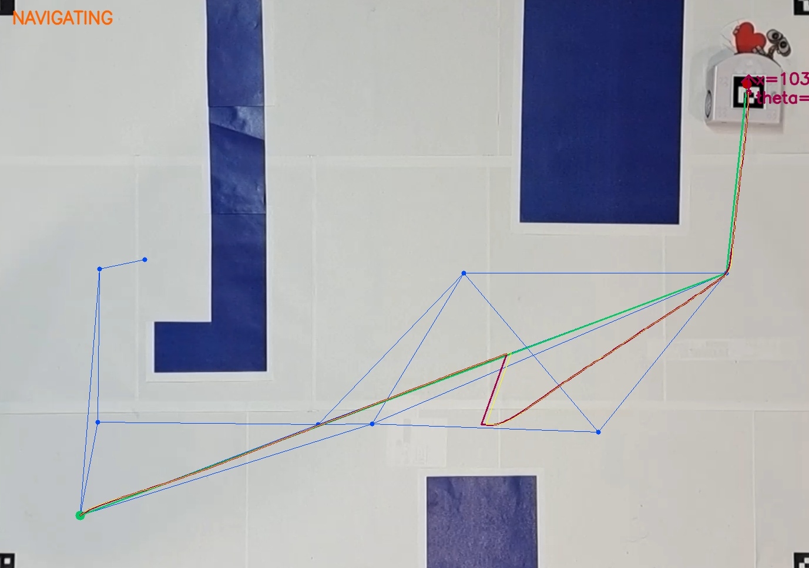

# Global-Local Robot Navigation: EVE's Journey

**Final Project for EPFL MICRO-452: Basics of Mobile Robotics**

This project implements a complete autonomous navigation stack for a Thymio II robot. It features computer vision for mapping, global graph-based path planning, Extended Kalman Filter (EKF) sensor fusion for state estimation, and a reactive hierarchical controller for local obstacle avoidance.

**The Concept:** Inspired by _WALL·E_, the robot (EVE) must navigate the interior of the spaceship _Axiom_. The mission is to reach a goal location while avoiding static structural voids ("Windows") and dynamic, unpredictable moving objects ("Passengers").



## 📖 Full Report

For a deep dive into the theoretical background, mathematical derivations of the EKF, and experimental validation, please refer to the [**Project Report (Jupyter Notebook)**](Group_T07_report.ipynb).

---

## 1. Physical Setup

### 1.1 The Environment

The playground is a 130x92 cm white arena defined by ArUco markers at the corners.

1.  **Static Global Obstacles (The Windows):** Dark blue polygonal cutouts. These are detected by the overhead camera but are invisible to the robot's horizontal sensors. They represent fatal zones that must be planned around.
2.  **Ephemeral Local Obstacles (The Passengers):** 3D physical objects (cylinders/blocks). These are ignored by the global mapper but detected by the robot's onboard proximity sensors, requiring reactive avoidance.

### 1.2 The Robot

A **Thymio II** differential-drive robot equipped with:

-   **Sensors:** Horizontal IR proximity sensors for local avoidance.
-   **Comms:** RF dongle via `tdmclient`.
-   **Visual Marker:** A top-mounted ArUco tag for ground-truth localization.

### 1.3 The Camera

An overhead camera (Smartphone via Camo Studio / Webcam) streaming at 1080p, used for initial map construction and continuous global localization updates.

---

## 2. Software Architecture

The system operates on a standard robotics control loop: **Perception $\rightarrow$ Estimation $\rightarrow$ Planning $\rightarrow$ Control**.

### 2.1 Vision & Mapping ([`vision.py`](src/vision.py))

-   **Perspective Correction:** Warps the raw camera feed into a metric top-down view using homography.
-   **Static Mapping:** Runs once at startup. Segments obstacles (HSV color space), approximates contours into polygons, and generates a **Configuration Space** by buffering obstacles by the robot's radius.
-   **Visibility Graph:** Constructs a graph connecting all mutually visible obstacle vertices and the goal.
-   **Localization:** Continuously detects the robot's pose $(x, y, \theta)$ via ArUco markers.

### 2.2 Global Path Planning ([`pathfinding.py`](src/pathfinding.py))

-   **Algorithm:** **A\* (A-Star)** search on the Visibility Graph.
-   **Dynamic Linking:** When the robot is "kidnapped" or placed at a start point, the system dynamically connects the robot's position to the existing static visibility graph to compute a path without re-mapping the whole world.

### 2.3 State Estimation ([`extended_kalman_filter.py`](src/extended_kalman_filter.py))

Fuses high-frequency, drifting odometry with low-frequency, noisy camera measurements.

-   **Model:** Non-linear kinematic unicycle model (in [`thymio_math_model.py`](src/thymio_math_model.py)).
-   **Uncertainty:** Uses a data-driven approach where process noise $\mathbf{Q}$ scales linearly with wheel speeds (based on experimental variance analysis).

### 2.4 Motion Control ([`control.py`](src/control.py))

A hierarchical Finite State Machine (FSM) manages behavior:

1.  **NAVIGATING:** Uses a P-controller to track global waypoints.
2.  **AVOIDING:** Triggered by proximity sensors. Uses a Braitenberg-inspired reactive controller to evade local threats.
3.  **DECAY PHASE:** A transition state that linearly blends the avoidance vector back into the navigation vector over 4 seconds, preventing oscillation/chattering.

### 2.5 Orchestration ([`main.py`](src/main.py))

The entry point handles the mission lifecycle:

-   **Kidnapping Detection:** Detects if the robot is lifted (ground sensors) or manually moved (large EKF pose jump).
-   **Recovery:** Pauses motors, waits for stabilization, and triggers global re-planning from the new location.

---

## 3. Project Structure

```text
project
├── Group_T07_report.ipynb   # Detailed project report & theory
├── requirements.txt         # Python dependencies
├── src
│   ├── main.py              # ENTRY POINT: Main control loop & mission logic
│   ├── control.py           # Robot behavior (FSM, P-Controller, Avoidance)
│   ├── extended_kalman_filter.py # EKF implementation
│   ├── thymio_math_model.py # Kinematics & Jacobians for EKF
│   ├── vision.py            # OpenCV logic, Mapping, Graph generation
│   ├── pathfinding.py       # A* Algorithm
│   └── utils.py             # Shared types (Pose, Point) & geometry helpers
└── images/                  # Assets for report and readme
```

---

## 4. Installation & Usage

### Prerequisites

-   Python 3.13
-   Thymio Suite (installed and running)
-   A connected Thymio II robot (RF Dongle preferred)
-   A webcam or smartphone camera source

### Setup

1.  Clone the repository:
    ```bash
    git clone https://github.com/your-username/your-repo.git
    cd your-repo
    ```
2.  Create and activate a virtual environment (optional but recommended):
    ```bash
    python -m venv venv
    venv\Scripts\activate  # On Linux/MacOS: source venv/bin/activate
    ```
3.  Install dependencies:

    ```bash
    pip install -r requirements.txt
    ```

4.  Add a `vision_debug/` directory in the root for saving debug images:
    ```bash
    mkdir vision_debug
    ```

### Running the Robot

Ensure the Thymio is powered on and the Thymio Suite is running.

```bash
cd src
python main.py --camera 1 --warmup 5
```

-   `--camera`: Index of the camera device (default: 1).
-   `--warmup`: Seconds to wait for camera auto-exposure to settle (default: 5).

### Development Guidelines

If contributing to the codebase, please format your code using **Ruff** with a line length of 100:

```bash
ruff format --line-length 100 .
```

---

## 5. Credits & License

**Team T07:**

-   John Constantin
-   Marcus Edjolo
-   Tancrede Lamort de Gail
-   Yvan Barragan

Developed at EPFL for MICRO-452.
