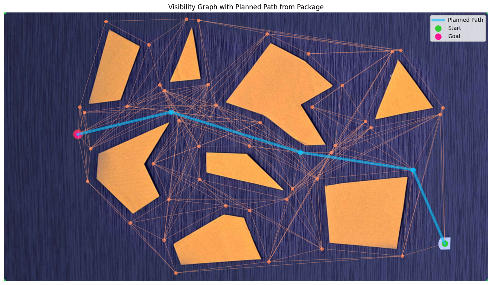

# Global-Local Robot Navigation Through Obstacle-Filled Environments

The final project for EPFL's [**MICRO-452: Basics of Mobile Robotics**](https://edu.epfl.ch/coursebook/en/basics-of-mobile-robotics-MICRO-452) course. This project implements a complete navigation stack for a differential drive robot, featuring computer vision, graph-based path planning, sensor fusion (EKF), and reactive control.

**The Concept:** Inspired by the duel on **Mustafar**, the robot must navigate a treacherous environment containing "Lava Pools" (static zones that are fatal to touch but invisible to onboard sensors) and "Falling Rocks" (dynamic obstacles that appear mid-run and must be dodged locally).



## 1. Physical Setup

The project tasks a Thymio II robot with navigating from a start pose to a goal pose while avoiding two distinct types of obstacles.

### 1.1 The Environment

The environment presents a dual-layer challenge:

1.  **Static "Global" Obstacles (The Lava):**
    -   **Physicality:** Flat, colored polygonal cutouts.
    -   **Visibility:** _Invisible_ to the robot's onboard horizontal proximity sensors, but clearly visible to the overhead global camera.
    -   **Constraint:** The robot cannot drive over them. Avoiding them relies entirely on accurate global localization and path planning.
2.  **Ephemeral "Local" Obstacles (The Rocks):**
    -   **Physicality:** 3D physical objects (cylinders, blocks) roughly the size of the robot.
    -   **Visibility:** Visible to the robot's onboard sensors, but _ignored_ by the global camera mapping (or placed after mapping is complete).
    -   **Constraint:** These act as dynamic blockers. The robot must use local sensing to reactively avoid them without losing track of its global objective.

### 1.2 The Robot

The **Thymio II** is a differential-drive mobile robot.

-   **Sensors:** 5 front-facing and 2 rear-facing horizontal IR proximity sensors (for local avoidance).
-   **Comms:** Python API interfacing via USB/RF dongle.
-   **Markers:** An ArUco marker is mounted on top of the robot to facilitate high-precision global tracking (Pose: $x, y, \theta$) via the overhead camera.

### 1.3 The Camera

A standard webcam ($1920 \times 1080$, RGB, 30 FPS) is mounted overhead. It serves as the "GPS" of the system, responsible for:

1.  **Initial Mapping:** Detecting static obstacle polygons and the goal area.
2.  **Live Tracking:** Providing absolute position estimates to correct the robot's drifting odometry.

---

## 2. Software Architecture

The system is built on a standard robotic control loop consisting of Perception, Estimation, Planning, and Control.

### 2.1 Vision ([`vision.py`](src/vision.py))

-   **Encapsulation:** Handles all OpenCV logic, camera calibration, and perspective warping.
-   **Mapping (One-Shot):** Runs at startup. Segments static obstacles ("Lava"), dilates them by the robot's radius + safety margin, and constructs a **Visibility Graph** using Shapely.
-   **Localization (Loop):** Runs continuously. Detects the ArUco marker to provide global $(x, y, \theta)$ measurements.

### 2.2 Global Path Planning ([`pathfinding.py`](src/pathfinding.py))

-   **Algorithm:** **A\* Search** on the Visibility Graph.
-   **Why A\*?** Since this is a point-to-point query on a weighted graph (Euclidean distance), A\* is more efficient than Dijkstra as it directs the search toward the goal using a heuristic.
-   **Output:** A list of coordinate waypoints $[W_1, W_2, ... W_{goal}]$ representing the optimal path through the "safe" zones.

### 2.3 State Estimation ([`state_estimation.py`](src/state_estimation.py))

-   **Problem:** Wheel odometry drifts over time; Vision is accurate but has latency and noise.
-   **Solution:** An **Extended Kalman Filter (EKF)** fuses these two inputs.
    -   _Prediction:_ High-frequency updates based on motor commands (Odometry model).
    -   _Update:_ Lower-frequency corrections based on global camera measurements.

### 2.4 Motion Control ([`control.py`](src/control.py))

The robot operates on a **Switching Finite State Machine (FSM)**. We avoid "stacking" behaviors (adding vectors) to prevent the robot from freezing when goals and obstacles cancel each other out.

#### State A: `NAVIGATING`

-   **Trigger:** Path is clear (IR sensors < threshold).
-   **Logic:** A **P-Controller with Speed Regulation**.
    -   _Note:_ We intentionally omit I and D terms. The Derivative term amplifies visual noise (jitter), and the Integral term risks windup during long turns. A tuned P-controller provides the smoothest trajectory for this specific hardware.
    -   _Mechanism:_ The robot turns proportional to the heading error, and slows its forward speed as the turning angle increases (organic turning).

#### State B: `AVOIDING`

-   **Trigger:** IR sensors detect an object ("Rock") in the immediate path.
-   **Logic:** **Braitenberg / Reactive Control**.
    -   The robot essentially "fears" the object, turning away from the sensor with the highest reading while maintaining forward momentum.
    -   Once the sensors are clear, the FSM switches back to `NAVIGATING`, and the robot aims for its current waypoint again.

---

## 3. Code Structure

The project is organized to separate concerns and minimize circular dependencies:

```text
src
├── main.ipynb              # Orchestrator: Initializes modules and runs the main control loop.
├── utils.py                # Shared definitions: Point & Pose named tuples, geometry helpers, etc.
├── vision.py               # Hardware abstraction for Camera, Map Construction, and ArUco tracking.
├── pathfinding.py          # Pure algorithmic implementation of A*.
├── state_estimation.py     # EKF implementation for sensor fusion.
└── control.py              # Robot behavior/control logic (FSM, P-Controller, Avoidance).
```

---

## 4. Assumptions & Constraints

To ensure feasible implementation within the scope of the course:

1.  **Obstacle Separation:** Local obstacles ("Rocks") will not be placed in locations that force the robot into Global obstacles ("Lava").
2.  **Corner Safety:** Local obstacles will not be placed immediately before a sharp blind corner, ensuring the robot doesn't evade a rock only to turn blindly into a lava pool.
3.  **Path Validity:** Local obstacles will block the direct path but will allow for a local bypass; they will not completely seal off a route (which would require global re-planning).
4.  **Flat World:** The ground is perfectly flat; the overhead camera perspective matrix is constant.
